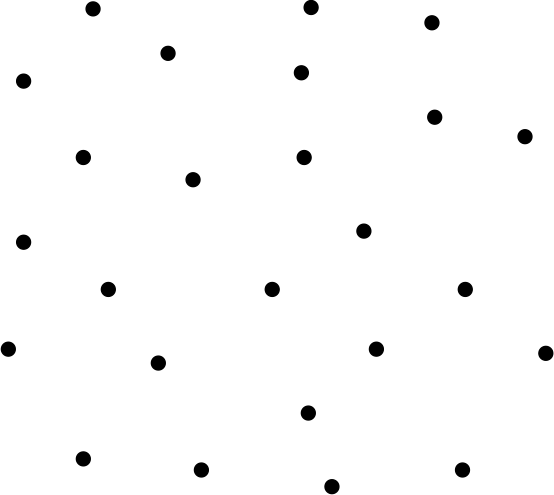
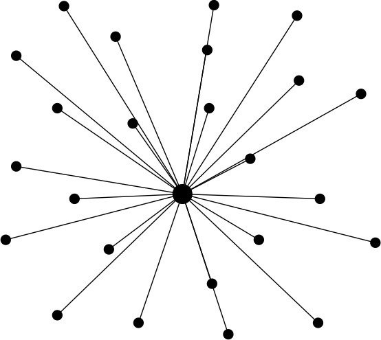
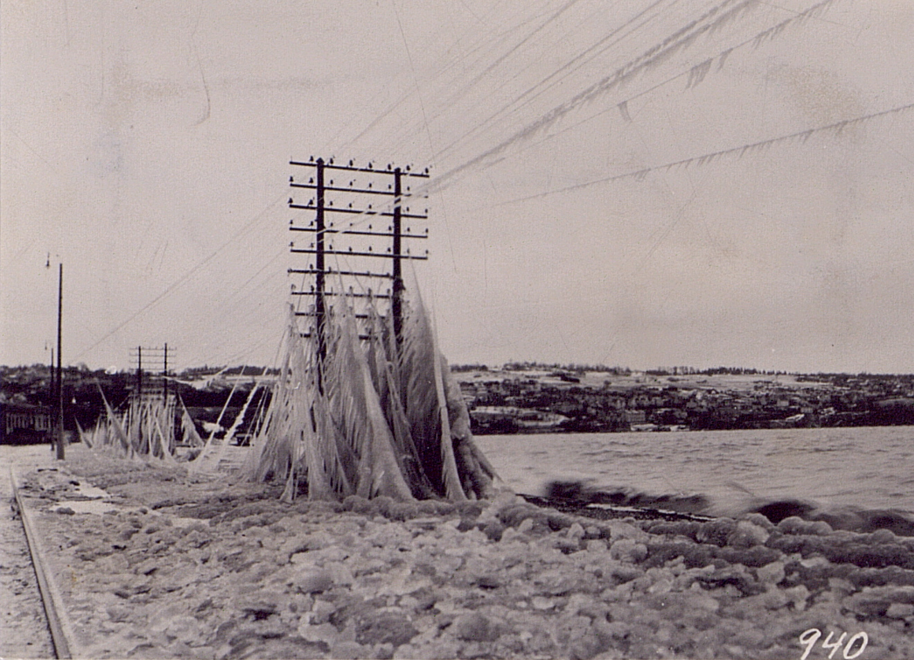

theme: Zurich, 1
footer: Kenji Rikitake / oueees 201806 part 1 26-JUN-2018
slidenumbers: true
autoscale: true

# oueees-201806 talks Part 1/3: Packet Switching

<!-- Use Deckset 2.0, 4:3 aspect ratio -->

---

# Kenji Rikitake

26-JUN-2018
School of Engineering Science
Osaka University
Toyonaka, Osaka, Japan
@jj1bdx

Copyright ©2018 Kenji Rikitake.
This work is licensed under a [Creative Commons Attribution 4.0 International License](https://creativecommons.org/licenses/by/4.0/).

---

# Lecture notes

* <https://github.com/jj1bdx/oueees-201806-public/>
* Check out the README.md file and the issues!

---

# Reporting

* Keyword at the end of the talk
* URL for submitting the report at the end of the talk

---

# Before starting the today's talk: the risk of being a professional and exposure to the public

* You might be harassed, harmed, and attacked at any time
* The attackers are *anonymous* while you are *well-identified*
* *Anyone can be a target*
* Stay low profile when you can
* Stay vigilant

---

# Today's topic: communication fundamentals of the packet switching networks

---

# Communication: sharing a medium

* Sharing a physical link between two or multiple parties
* *The physical layer*
* A medium could be: electric wires, optic fibers, radio airwaves, sound, flying birds like pigeons

---

# Connecting unconnected nodes

There are many ways to connect the dots in this picture

---

# Simplest way: star/centralized connection

- Centralized connection was the easiest way to connect the nodes
- Very much susceptible to network link failures
- Links should stay connected during the connection

---

# The old Stockholm telephone tower in 1890

` `

---

# Fallen telephone lines by frost at Jönköping, Sweden, 1929

` `

---

# Tekniska museet in Stockholm (June 2018)

` `

---

# Multiplexing

Sharing the same link by multiple nodes and communication devices

---

# Multiplexing enables decentralization

- Some links carry shared traffics for many different nodes

---

# Photo credits

* All photos are modified and edited by Kenji Rikitake
* Photos are from Unsplash.com unless otherwise noted

* Title: [Shane Rounce](https://unsplash.com/photos/1ZZ96uESRJQ)
* Stockholm telephone tower: [Tekniska museet](https://www.flickr.com/photos/tekniskamuseet/6838150900/in/album-72157629589461917/), from Flickr, CC-BY-2.0
* Jönköping telephone lines: [Tekniska museet](https://www.flickr.com/photos/tekniskamuseet/6978810049/in/album-72157629575713829/), from Flickr, CC-BY-2.0
* Tekniska museet photo: Kenji Rikitake, CC-BY-2.0

<!--
Local Variables:
mode: markdown
coding: utf-8
End:
-->
