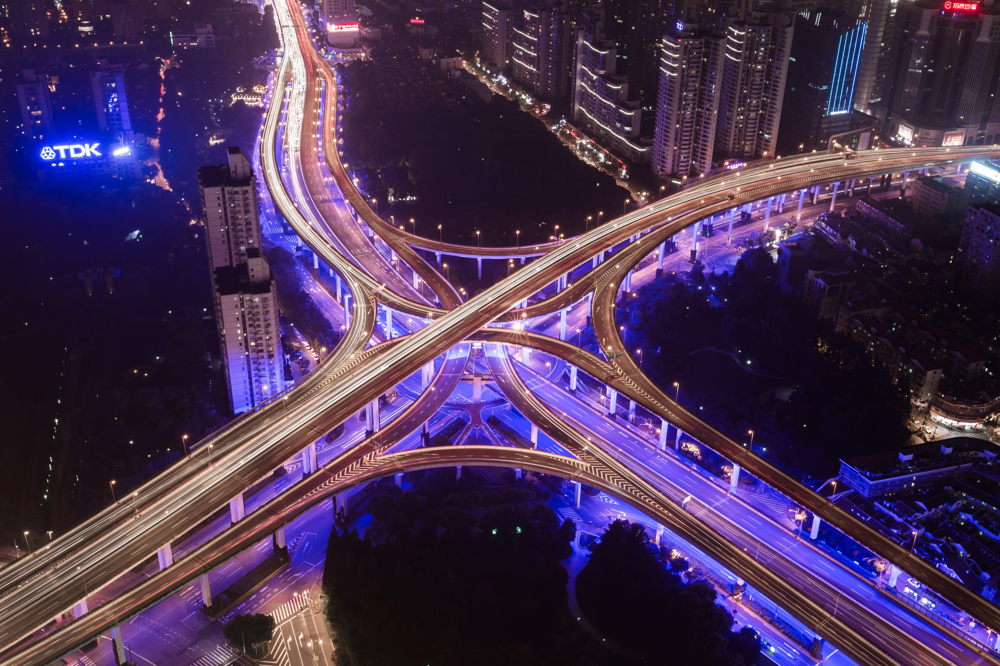

theme: Zurich, 1
footer: Kenji Rikitake / oueees 201806 part 2 3-JUL-2018
slidenumbers: true
autoscale: true

# oueees-201806 talks Part 2/3:Routing and transport protocols

<!-- Use Deckset 2.0, 4:3 aspect ratio -->

---

# Kenji Rikitake

3-JUL-2018
School of Engineering Science
Osaka University
Toyonaka, Osaka, Japan
@jj1bdx

Copyright ©2018 Kenji Rikitake.
This work is licensed under a [Creative Commons Attribution 4.0 International License](https://creativecommons.org/licenses/by/4.0/).

---

# Lecture notes

* <https://github.com/jj1bdx/oueees-201806-public/>
* Check out the README.md file and the issues!

---

# Reporting

* Keyword at the end of the talk
* URL for submitting the report at the end of the talk

---

# Today's topic: flexible packet routing and transport protocols

---

# Various aspects of routing

* Delivery
* Addresses
* Static or dynamic
* Route aggregation
* Security

---

# Delivery schemes

* Unicast
* Broadcast/Multicast/Anycast

---
[.background-color: #FFFFFF]

---
[.background-color: #FFFFFF]

---

# Internet protocol (IP) and IP addresses

---

# Role of IP addresses

* Network numbers
* Interfaces: connected to the networks
* Host IDs in the numbered networks
* Global uniqueness
* Special addresses (private, broadcast, multicast, loopback, etc.)

---

# [fit] IPv4 addresses: 32 bits
# [fit] 192.168.100.20
# [fit] In hexadecimal notation: 0xC0A86414

- 4 x 0~255 numbers split with dots
- Relatively easy to remember, but already being used up

---

# [fit] IPv4 address with netmask
# [fit] 192.168.100.20/24

- Network: 192.168.100.0/24
- Host: number 20 (0~255) (32-24=8)
- Host 0 = network itself
- Host 255 = broadcast

---

# [fit] Address in another netmask
# [fit] 192.168.100.20/28

- Network: 192.168.100.16/28
- Host: number 2 (0~15) (32-24=4)
- Host 0 = network itself
- Host 15 = broadcast
- Different netmask = different address interpretation

---

# Private addresses (RFC1918)
# [fit] No global routing for these address blocks

- 10.0.0.0/8
- 172.16.0.0/12 (172.{16~31}.\*.\*)
- 192.168.0.0/16 (192.168.\*.\*)

---

# Other special addresses (RFC6890)

- 0.0.0.0/8: "This" network
- 100.64.0.0/10: Shared address
- 127.0.0.0/8: Loopback
- 169.254.0.0/16: Link local
- 192.0.0.0/24: IANA specific
- 192.0.2.0/24, 198.51.100.0/24, 203.0.113.0/24: Documentation
- 192.88.99.0/24: 6to4 Relay Anycast
- 198.18.0.0/15: Benchmarking
- 240.0.0.0/4: Reserved
- 255.255.255.255/32: Limited broadcast

---

# [fit] IPv6 addresses: 128 bits
# [fit] 2404:6800:400a:80c::2004
# [fit] = 2404:6800:400a:080c:0000:0000:0000:2004

* www.google.com as of 2-JUL-2018 0905UTC
* :xxxx: = up to 4 hex digits
* :: = arbitrary number of 0, appearing only once in an address

---

# [fit] IPv6 addresses with netmask
# [fit] 2404:6800:400a:80c::2004/64

* Network: 2404:6800:400a:80c::/64
* Host number: 0x0000000000002004
* Host number: 64 bits (0: network)
* Broadcast -> multicast addresses
* ff02::1 = all hosts, ff02::2 = all routers, etc.

---

# Why IPv4 to IPv6?

- Because we've used up the 32-bit IPv4 addresses already
- No more new address block for IPv4
- You need to buy unused blocks from other users
- Took ~20 years (1996-2016) for the transition from IPv4 to IPv6

---

# Topics on next talk

* Cloud computing .vs. endpoint computing
* Sharing .vs. message passing
* Centralization .vs. decentralization

---

# Photo credits

* All photos are modified and edited by Kenji Rikitake
* Photos are from Unsplash.com unless otherwise noted

* Title: [Denis Nevozhai](https://unsplash.com/photos/_QoAuZGAoPY)
* Stockholm telephone tower: [Tekniska museet](https://www.flickr.com/photos/tekniskamuseet/6838150900/in/album-72157629589461917/), from Flickr, CC BY 2.0
* Jönköping telephone lines: [Tekniska museet](https://www.flickr.com/photos/tekniskamuseet/6978810049/in/album-72157629575713829/), from Flickr, CC BY 2.0
* Tekniska museet photo: Kenji Rikitake, CC BY 4.0
* Packet Switching animated GIF: [By Oddbodz from Wikimedia Commons](https://upload.wikimedia.org/wikipedia/commons/f/f6/Packet_Switching.gif), CC BY-SA 3.0
* Internet packet switching: [By Computer-blue.svg: OpenClipartderivative work: Pluke (Computer-blue.svg)](https://upload.wikimedia.org/wikipedia/commons/c/c0/CPT-internet-packetswitching.svg), via Wikimedia Commons, CC0 (Public Domain)

<!--
Local Variables:
mode: markdown
coding: utf-8
End:
-->
